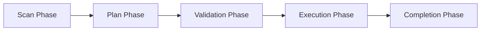

# Mass Find Replace (MFR)

[](https://www.python.org/downloads/)
[](https://opensource.org/licenses/MIT)
[](https://github.com/astral-sh/ruff)
[](https://github.com/astral-sh/uv)

A sophisticated Python tool for performing safe, surgical find-and-replace operations across entire directory structures. MFR can rename files, folders, and modify file contents while preserving file encodings, handling Unicode correctly, and preventing data loss through intelligent collision detection.

## Table of Contents
- [Features](#-features)
- [Quick Start](#-quick-start)
- [Installation](#-installation)
- [Usage](#-usage)
- [Safety Features](#️-safety-features)
- [Troubleshooting](#-troubleshooting)
- [Contributing](#-contributing)
- [License](#-license)

## 🎯 Quick Start

```bash
# Install uv (if not already installed)
curl -LsSf https://astral.sh/uv/install.sh | sh

# Clone and setup
git clone https://github.com/Emasoft/MFR.git
cd MFR
uv sync

# Configure replacements
echo '{
  "REPLACEMENT_MAPPING": {
    "old_name": "new_name",
    "OldProject": "NewProject"
  }
}' > replacement_mapping.json

# Preview changes
uv run mfr . --dry-run

# Execute replacements
uv run mfr .
```

## 🚀 Features

### Core Capabilities
- **Transaction-based system**: All operations are logged in `planned_transactions.json` for safety and resumability
- **Intelligent collision detection**: Prevents overwriting files with case-insensitive name conflicts
- **Binary file handling**: Detects binary files and logs matches without modification
- **Encoding preservation**: Automatically detects and preserves original file encodings
- **Unicode normalization**: Handles diacritics and control characters correctly with NFC normalization
- **Multiple execution modes**: Dry-run, interactive, force, and resume modes

### Advanced Features
- **Resume capability**: Interrupted operations can be resumed from where they left off
- **Atomic operations**: Uses transaction states (PENDING, IN_PROGRESS, COMPLETED, FAILED, SKIPPED)
- **Selective processing**: Choose to process only file names, folder names, or file contents
- **Symlink support**: Optional processing of symbolic link names
- **Customizable exclusions**: Exclude specific directories or file extensions
- **Detailed logging**: Comprehensive logs for debugging and audit trails

## 📦 Installation

### Prerequisites
- Python 3.10 or higher
- [uv](https://github.com/astral-sh/uv) package manager (recommended)

### Installing uv

UV is a fast Python package and project manager that replaces pip, pip-tools, virtualenv, and more.

**macOS and Linux:**
```bash
curl -LsSf https://astral.sh/uv/install.sh | sh
```

**Windows:**
```powershell
winget install astral-sh.uv
# or with installer:
irm https://astral.sh/uv/install.ps1 | iex
```

**With pip (fallback):**
```bash
pip install uv
```

### Install from Source (Recommended)

```bash
# Clone the repository
git clone https://github.com/Emasoft/MFR.git
cd MFR

# Create virtual environment and install dependencies
uv sync

# The mfr command is now available via uv run
uv run mfr --help
```

### Install as a Package

```bash
# Build and install from source
git clone https://github.com/Emasoft/MFR.git
cd MFR
uv build
uv pip install dist/mass_find_replace-*.whl

# Or install directly from GitHub
uv pip install git+https://github.com/Emasoft/MFR.git
```

### Install from PyPI (Coming Soon)

```bash
# Once published to PyPI
uv pip install mass-find-replace
```

### Development Installation

```bash
# Clone the repository
git clone https://github.com/Emasoft/MFR.git
cd MFR

# Install with all development dependencies
uv sync --all-extras

# Install in editable mode
uv pip install -e .

# Install pre-commit hooks
uv run pre-commit install
uv run pre-commit install --hook-type pre-push

# Run tests
uv run pytest

# Run linters
uv run pre-commit run --all-files
```

### Docker Installation

```bash
# Using Docker Compose
git clone https://github.com/Emasoft/MFR.git
cd MFR

# Run with Docker
docker-compose run mfr /workspace --dry-run

# Or build manually
docker build -t mass-find-replace:latest .
docker run -v $(pwd):/workspace mass-find-replace /workspace --dry-run
```

## 🎯 Usage

### Basic Usage

1. **Configure your replacements** by editing `replacement_mapping.json`:
```json
{
  "REPLACEMENT_MAPPING": {
    "OldProjectName": "NewProjectName",
    "old_function_name": "new_function_name",
    "deprecatedMethod": "modernMethod",
    "legacyModule": "updatedModule"
  }
}
```

2. **Preview changes** (dry run):
```bash
mfr /path/to/project --dry-run
```

3. **Execute replacements**:
```bash
mfr /path/to/project
```

### Real-World Examples

#### Example 1: Renaming a Function Across a Codebase
You need to rename `getUserData()` to `fetchUserProfile()` across your entire JavaScript project:

```json
{
  "REPLACEMENT_MAPPING": {
    "getUserData": "fetchUserProfile"
  }
}
```

```bash
# Preview the changes
mfr ./src --dry-run --extensions .js,.jsx,.ts,.tsx

# Execute with interactive confirmation
mfr ./src --interactive --extensions .js,.jsx,.ts,.tsx
```

#### Example 2: Changing Library Imports
Migrating from an old library to a new one (e.g., `moment` to `date-fns`):

```json
{
  "REPLACEMENT_MAPPING": {
    "from 'moment'": "from 'date-fns'",
    "require('moment')": "require('date-fns')",
    "import moment": "import * as dateFns"
  }
}
```

```bash
# Process only JavaScript/TypeScript files
mfr ./src --extensions .js,.jsx,.ts,.tsx
```

#### Example 3: Rebranding a Project
Changing all variations of a project name:

```json
{
  "REPLACEMENT_MAPPING": {
    "OldBrand": "NewBrand",
    "oldbrand": "newbrand",
    "OLDBRAND": "NEWBRAND",
    "old-brand": "new-brand",
    "old_brand": "new_brand"
  }
}
```

```bash
# Run on entire project, excluding node_modules and .git
mfr . --exclude-dirs node_modules,.git,dist,build
```

#### Example 4: API Endpoint Migration
Updating API endpoints across configuration files:

```json
{
  "REPLACEMENT_MAPPING": {
    "api.oldservice.com": "api.newservice.com",
    "/v1/": "/v2/",
    "apiKey": "accessToken"
  }
}
```

```bash
# Target only configuration files
mfr ./config --extensions .json,.yaml,.yml,.env,.ini
```

### Command-Line Options

```bash
mfr [directory] [options]
```

#### Complete Help Output

```
usage: mfr [-h] [--mapping-file MAPPING_FILE]
           [--extensions EXTENSIONS [EXTENSIONS ...]]
           [--exclude-dirs EXCLUDE_DIRS [EXCLUDE_DIRS ...]]
           [--exclude-files EXCLUDE_FILES [EXCLUDE_FILES ...]]
           [--no-gitignore] [--ignore-file PATH] [--process-symlink-names]
           [--skip-file-renaming] [--skip-folder-renaming] [--skip-content]
           [--dry-run] [--skip-scan] [--resume] [--force] [-i]
           [--timeout MINUTES] [--quiet] [--verbose] [--self-test]
           [directory]

MFR - Mass Find Replace - A script to safely rename things in your project
Find and replace strings in files and filenames/foldernames within a project
directory. It operates in three phases: Scan, Plan (creating a transaction
log), and Execute. The process is designed to be resumable and aims for
surgical precision in replacements. Binary file content is NOT modified;
matches within them are logged to 'binary_files_matches.log'.

positional arguments:
  directory             Root directory to process (default: current directory)

options:
  -h, --help            show this help message and exit
  --mapping-file MAPPING_FILE
                        Path to the JSON file with replacement mappings
                        (default: ./replacement_mapping.json)
  --extensions EXTENSIONS [EXTENSIONS ...]
                        List of file extensions for content scan (e.g. .py
                        .txt .rtf). Default: attempts to process recognized
                        text-like files
  --exclude-dirs EXCLUDE_DIRS [EXCLUDE_DIRS ...]
                        Directory names to exclude (space-separated).
                        Default: .git .venv etc.
  --exclude-files EXCLUDE_FILES [EXCLUDE_FILES ...]
                        Specific files or relative paths to exclude
                        (space-separated)
  --timeout MINUTES     Maximum minutes for the retry phase when files are
                        locked/inaccessible. Set to 0 for indefinite retries
                        (until CTRL-C). Minimum 1 minute if not 0.
                        Default: 10 minutes

Ignore File Options:
  --no-gitignore        Disable using .gitignore file for exclusions. Custom
                        ignore files will also be skipped
  --ignore-file PATH    Path to a custom .gitignore-style file for additional
                        exclusions

Symlink Handling:
  --process-symlink-names
                        If set, symlink names WILL BE PROCESSED for renaming.
                        Default: symlink names are NOT processed for renaming.
                        Symlink targets are never followed for content
                        modification by this script

Skip Operation Options:
  --skip-file-renaming  Skip all file renaming operations
  --skip-folder-renaming
                        Skip all folder renaming operations
  --skip-content        Skip all file content modifications. If all three
                        --skip-* options are used, the script will exit with
                        'nothing to do'

Execution Control:
  --dry-run             Scan and plan changes, but do not execute them.
                        Reports what would be changed
  --skip-scan           Skip scan phase; use existing 'planned_transactions.json'
                        in the root directory for execution
  --resume              Resume operation from existing transaction file,
                        attempting to complete pending/failed items and scan
                        for new/modified ones
  --force, --yes, -y    Force execution without confirmation prompt
                        (use with caution)
  -i, --interactive     Run in interactive mode, prompting for approval
                        before each change

Output Control:
  --quiet, -q           Suppress initial script name print and some
                        informational messages from direct print statements
                        (Prefect logs are separate). Also suppresses the
                        confirmation prompt, implying 'yes'
  --verbose             Enable more verbose output, setting Prefect logger
                        to DEBUG level

Developer Options:
  --self-test           Run automated tests for this script
```

### Understanding the Transaction System

MFR uses a transaction-based approach for safety:



1. **Scan Phase**: Identifies all files and replacements needed
2. **Plan Phase**: Creates `planned_transactions.json` with all operations
3. **Validation Phase**: Checks for conflicts and circular dependencies
4. **Execution Phase**: Applies changes with verification
5. **Completion Phase**: Updates transaction states

Transaction states:
- `PENDING`: Operation not yet started
- `IN_PROGRESS`: Currently being processed
- `COMPLETED`: Successfully finished
- `FAILED`: Operation failed (check logs)
- `SKIPPED`: Skipped due to user choice or conflict
- `RETRY_LATER`: Temporary failure, will retry

### Configuration Files

#### replacement_mapping.json
The main configuration file defining your find-and-replace mappings. **You must edit this file before running MFR** to define what strings you want to replace.

##### How to Create/Edit the Configuration

1. **Create the file** (if it doesn't exist):
```bash
# Create a new replacement_mapping.json
cat > replacement_mapping.json << 'EOF'
{
  "REPLACEMENT_MAPPING": {
    "old_string": "new_string"
  }
}
EOF
```

2. **Edit with your replacements**:
```json
{
  "REPLACEMENT_MAPPING": {
    "OldCompanyName": "NewCompanyName",
    "old-project-name": "new-project-name",
    "deprecatedFunction": "modernFunction",
    "legacy_variable": "updated_variable",
    "OLD_CONSTANT": "NEW_CONSTANT",
    "http://old-api.com": "https://new-api.com",
    "Copyright 2020": "Copyright 2024",
    "TODO: fix this": "DONE: fixed"
  }
}
```

##### Configuration Rules

**Important notes**:
- **Case matters**: `"oldName"` and `"OldName"` are different replacements
- **Order doesn't matter**: MFR processes longest matches first automatically
- **No recursive replacements**: If A→B and B→C, MFR will prevent this
- **Unicode support**: Full support for international characters, emojis, etc.
- **Special characters**: All JSON-valid strings are supported

##### Advanced Examples

**Multiple case variations**:
```json
{
  "REPLACEMENT_MAPPING": {
    "OldProduct": "NewProduct",
    "oldProduct": "newProduct",
    "old-product": "new-product",
    "old_product": "new_product",
    "OLDPRODUCT": "NEWPRODUCT"
  }
}
```

**Namespace/package renaming**:
```json
{
  "REPLACEMENT_MAPPING": {
    "com.oldcompany.app": "com.newcompany.app",
    "from oldpackage import": "from newpackage import",
    "@oldcompany/library": "@newcompany/library"
  }
}
```

**File path updates**:
```json
{
  "REPLACEMENT_MAPPING": {
    "/old/path/to/resource": "/new/path/to/resource",
    "../legacy/module": "../modern/module",
    "assets/old-logo.png": "assets/new-logo.png"
  }
}
```

##### Validation

Before running MFR, validate your JSON:
```bash
# Check if JSON is valid
python -m json.tool replacement_mapping.json

# Or use jq if available
jq . replacement_mapping.json
```

#### planned_transactions.json
Generated during the scan phase, this file contains all planned operations:

```json
{
  "version": "1.0",
  "transactions": [
    {
      "id": "unique-transaction-id",
      "type": "file_content",
      "source_path": "/path/to/file.js",
      "status": "PENDING",
      "encoding": "utf-8",
      "changes": [
        {
          "line": 42,
          "old": "getUserData()",
          "new": "fetchUserProfile()"
        }
      ]
    }
  ]
}
```

## 🛡️ Safety Features

### Collision Detection
MFR prevents overwrites when renaming would create conflicts:
- **Case-insensitive detection**: Prevents `File.txt` from overwriting `file.txt` on case-insensitive filesystems
- **Detailed reports**: All collisions logged to `collisions_errors.log`
- **Interactive handling**: Choose action for each collision in interactive mode

Example collision log:
```
=== Collision Detected ===
Transaction ID: abc123
Type: FILE_NAME
Original: OldProject_Config.py → NewProject_Config.py
Collision: Would overwrite existing file (case-insensitive match)
```

### Binary File Protection
- **Automatic detection**: Uses heuristics to identify binary files
- **Read-only scanning**: Binary files are never modified
- **Match logging**: Found patterns logged to `binary_files_matches.log`

Protected file types include:
- Executables (.exe, .dll, .so)
- Images (.jpg, .png, .gif, .bmp)
- Archives (.zip, .tar, .gz)
- Media files (.mp3, .mp4, .avi)
- Office documents (.docx, .xlsx, .pdf)

### Encoding Preservation
- **Auto-detection**: Supports UTF-8, UTF-16, Latin-1, GB18030, and more
- **Byte-perfect preservation**: Original encoding maintained
- **Fallback handling**: Graceful degradation for unknown encodings

### Resume Capability
- **Crash recovery**: Resume interrupted operations exactly where they left off
- **State persistence**: Transaction states saved after each operation
- **Idempotent operations**: Safe to retry failed operations

## 🐛 Troubleshooting

### Common Issues

**1. "Permission denied" errors**
- Ensure you have read/write permissions for all files
- On Windows, close any programs that might be using the files
- Use `--timeout` option for temporarily locked files

**2. "Collision detected" warnings**
- Review `collisions_errors.log` for details
- Use `--interactive` mode to handle case-by-case
- Consider using more specific replacement patterns

**3. Unicode/encoding errors**
- MFR handles encoding automatically, but check logs for details
- Ensure your `replacement_mapping.json` is valid UTF-8
- Use `--verbose` flag for detailed encoding information

**4. Transaction file conflicts**
- Use `--resume` to continue interrupted operations
- Delete `planned_transactions.json` to start fresh
- Check transaction status for `FAILED` entries

### Debug Mode

For detailed debugging information:
```bash
mfr /path/to/project --verbose --dry-run
```

This provides:
- Detailed encoding detection results
- Step-by-step transaction processing
- Full error stack traces
- Performance metrics

## 🧪 Testing

MFR includes a comprehensive test suite:

```bash
# Run all tests
uv run pytest

# Run with coverage
uv run pytest --cov=mass_find_replace --cov-report=html

# Run specific test
uv run pytest tests/test_mass_find_replace.py::test_dry_run_behavior -v

# Run built-in self-test
uv run mfr --self-test
```

## 🤝 Contributing

We welcome contributions! Here's how to get started:

### Development Setup

```bash
# Fork and clone the repository
git clone https://github.com/YOUR_USERNAME/MFR.git
cd MFR

# Install uv (if not already installed)
curl -LsSf https://astral.sh/uv/install.sh | sh

# Install development dependencies
uv sync --all-extras

# Install pre-commit hooks
uv run pre-commit install
uv run pre-commit install --hook-type pre-push

# Set up Git configuration
git config user.name "Your Name"
git config user.email "your.email@example.com"
```

### Development Workflow

1. **Create a feature branch**: `git checkout -b feature/your-feature-name`
2. **Follow TDD**: Write tests first, then implementation
3. **Run tests**: `uv run pytest`
4. **Check code quality**:
   ```bash
   # Run all pre-commit checks
   uv run pre-commit run --all-files

   # Or run individual tools
   uv run ruff format .                      # Format code
   uv run ruff check . --fix                 # Lint and fix issues
   uv run mypy src/ tests/                   # Type checking
   uv run deptry src                         # Dependency analysis
   uv run yamllint -c .yamllint.yml .        # YAML linting
   uv run bandit -r src                      # Security linting
   uv run pip-audit                          # Vulnerability scan
   gitleaks detect --source . --config .gitleaks.toml  # Secret scanning
   ```
5. **Update dependencies if needed**:
   ```bash
   # Add a new dependency
   uv add package-name

   # Add a dev dependency
   uv add --dev package-name

   # Update lock file
   uv lock
   ```
6. **Commit with semantic messages**:
   - `feat:` New feature
   - `fix:` Bug fix
   - `docs:` Documentation changes
   - `style:` Code style changes
   - `refactor:` Code refactoring
   - `test:` Test changes
   - `chore:` Maintenance tasks
7. **Push and create PR**

### Code Style Guidelines

- Use type annotations for all functions
- Write Google-style docstrings
- Keep functions focused and under 50 lines
- Maintain test coverage above 80%
- Follow existing patterns in the codebase
- Ensure all files pass pre-commit hooks
- Add changelog entry in code files when making changes

## 📄 License

This project is licensed under the MIT License - see the LICENSE file for details.

## 🏗️ Project Structure

```
MFR/
├── src/
│   └── mass_find_replace/
│       ├── __init__.py              # Package initialization
│       ├── mass_find_replace.py     # Main CLI entry point & workflow
│       ├── file_system_operations.py # File I/O & transaction handling
│       └── replace_logic.py         # String replacement logic
├── tests/
│   ├── conftest.py                  # Test fixtures and configuration
│   └── test_mass_find_replace.py    # Comprehensive test suite
├── scripts/
│   ├── setup-github.sh              # GitHub repository setup with GH CLI
│   ├── test-workflows.sh            # Test GitHub Actions locally
│   └── test-with-act.sh             # Test with act (Docker required)
├── .github/
│   └── workflows/
│       ├── ci.yml                   # Main CI/CD pipeline
│       ├── pre-commit.yml           # Pre-commit checks
│       ├── release.yml              # Release automation
│       └── security.yml             # Security scanning
├── dist/                            # Built distributions (after uv build)
├── .venv/                           # Virtual environment (created by uv)
├── replacement_mapping.json         # Your string replacements config
├── planned_transactions.json        # Generated transaction plan
├── requirements.txt                 # Production dependencies (auto-generated)
├── requirements-dev.txt             # Development dependencies (auto-generated)
├── pyproject.toml                   # Package configuration
├── uv.lock                          # UV lock file (commit this)
├── .pre-commit-config.yaml          # Pre-commit hooks configuration
├── .gitleaks.toml                   # Gitleaks secret scanning config
├── CLAUDE.md                        # AI assistant guidelines
├── SECURITY_SETUP.md                # Security configuration docs
├── README.md                        # This file
└── LICENSE                          # MIT License
```

## 📊 Performance & Limitations

### Performance Characteristics

- **Memory efficient**: Processes files line-by-line
- **Disk I/O optimized**: Minimizes file operations
- **Large file support**: Handles files up to 2GB efficiently
- **Transaction overhead**: ~10-20ms per file operation

### Known Limitations

1. **File size**: Best for files under 1GB (larger files work but slower)
2. **Binary files**: Detected but not modified (by design)
3. **Symlinks**: Only renames symlinks, doesn't follow them
4. **Concurrent access**: Files must not be locked by other processes
5. **Regex support**: Not supported (literal string matching only)

### Performance Tips

- Use `--extensions` to limit file types processed
- Exclude build directories with `--exclude-dirs`
- Run on SSD for best performance
- Use `--dry-run` first on large codebases

## 🚀 CI/CD Pipeline

### GitHub Actions Integration

MFR uses GitHub Actions for continuous integration and deployment, fully integrated with UV for fast, reliable builds.

#### Workflows

1. **CI/CD Pipeline** (`ci.yml`):
   - Multi-OS testing (Ubuntu, Windows, macOS)
   - Python version matrix (3.10, 3.11, 3.12)
   - Security scanning with Gitleaks
   - Automated builds and distribution
   - Release to PyPI (when tagged)

2. **Pre-commit Checks** (`pre-commit.yml`):
   - Runs all pre-commit hooks on every push
   - Ensures code quality standards

3. **Security Scanning** (`security.yml`):
   - Gitleaks for secret detection
   - pip-audit for vulnerability scanning
   - bandit for security linting
   - safety for known vulnerabilities

#### Local CI Testing

Test GitHub Actions locally using [act](https://github.com/nektos/act):

```bash
# Install act
brew install act  # macOS
# or see https://github.com/nektos/act for other platforms

# Test workflows
./scripts/test-workflows.sh

# Test specific workflow
act push -W .github/workflows/ci.yml

# Interactive mode
./scripts/test-with-act.sh
```

### UV Integration

UV is deeply integrated into the development workflow:

1. **Dependency Management**:
   - `uv.lock` ensures reproducible builds
   - `pyproject.toml` defines all dependencies
   - Auto-generated `requirements*.txt` for compatibility

2. **Pre-commit Hooks**:
   - Uses [uv-pre-commit](https://github.com/astral-sh/uv-pre-commit)
   - Compiles requirements on every commit
   - Runs all tools through UV for consistency

3. **GitHub Actions**:
   - Uses `astral-sh/setup-uv@v6` action
   - Caches dependencies for fast builds
   - Manages Python versions automatically

### Setting Up CI/CD

1. **Initialize GitHub Repository**:
```bash
# Authenticate with GitHub CLI
gh auth login

# Run setup script
./scripts/setup-github.sh
```

2. **Configure Secrets**:
```bash
# Add Codecov token (optional)
gh secret set CODECOV_TOKEN

# PyPI token (for releases)
gh secret set PYPI_API_TOKEN
```

3. **Enable Branch Protection**:
The setup script configures branch protection with:
- Required status checks
- Dismiss stale reviews
- No force pushes
- No deletions

## 🔮 Roadmap

### Version 1.0 (Current)
- ✅ Core find-replace functionality
- ✅ Transaction system
- ✅ Unicode support
- ✅ Resume capability
- ✅ Full UV integration
- ✅ Comprehensive CI/CD

### Version 1.1 (Planned)
- [ ] PyPI package release
- [ ] Regular expression support
- [ ] Configuration profiles
- [ ] Performance optimizations
- [ ] GitHub App integration

### Version 2.0 (Future)
- [ ] GUI interface
- [ ] IDE plugins (VSCode, IntelliJ)
- [ ] Parallel processing
- [ ] Cloud storage support
- [ ] Git integration
- [ ] Real-time collaboration

## ❓ FAQ

### Q: Is it safe to use on my production code?
**A:** Yes! MFR is designed with safety first:
- Always run `--dry-run` first to preview changes
- Transaction system ensures atomicity
- Automatic backups via transaction log
- Resume capability if interrupted

### Q: Can I undo changes?
**A:** Not automatically, but:
- Transaction log shows all changes made
- Use version control (git) for easy rollback
- Consider making a backup before large operations

### Q: Does it handle special characters?
**A:** Yes, MFR fully supports:
- Unicode characters (emoji, international text)
- Special characters in filenames
- Mixed encodings in the same project
- Control characters are normalized

### Q: What about case-sensitive filesystems?
**A:** MFR detects your filesystem type and:
- Prevents collisions on case-insensitive systems (macOS, Windows)
- Respects case on case-sensitive systems (Linux)
- Warns about potential issues

### Q: Can I use regular expressions?
**A:** Not currently. MFR uses literal string matching for safety and predictability. Regex support is planned for v1.1.

### Q: How do I exclude files?
**A:** Multiple ways:
- Use `--exclude-dirs` for directories
- Use `--exclude-files` for specific files
- Respects `.gitignore` by default
- Create custom ignore file with `--ignore-file`

### Q: What if a file is locked?
**A:** MFR will:
- Retry automatically (configurable with `--timeout`)
- Mark as `RETRY_LATER` in transaction log
- Continue with other files
- Resume later with `--resume`

## 🔒 Security

### Security Features

1. **Secret Scanning**:
   - Pre-commit Gitleaks integration
   - Pre-push hook prevents accidental secret commits
   - GitHub Actions security workflow
   - Custom rules for API keys, tokens, passwords

2. **Dependency Security**:
   - pip-audit for vulnerability scanning
   - safety for known CVEs
   - Automated dependency updates
   - Lock file for reproducible builds

3. **Code Security**:
   - bandit for Python security issues
   - Type checking with mypy
   - Secure defaults (no shell=True, etc.)

### Security Configuration

See [SECURITY_SETUP.md](SECURITY_SETUP.md) for detailed security configuration.

## 🙏 Acknowledgments

- Built with [uv](https://github.com/astral-sh/uv) for modern Python packaging
- Uses [Prefect](https://www.prefect.io/) for workflow orchestration
- Code quality by [Ruff](https://github.com/astral-sh/ruff)
- Security by [Gitleaks](https://github.com/gitleaks/gitleaks) and [Bandit](https://github.com/PyCQA/bandit)
- Pre-commit integration via [uv-pre-commit](https://github.com/astral-sh/uv-pre-commit)
- Inspired by various find-replace tools but built for safety and scale

## 📞 Support

- **Issues**: [GitHub Issues](https://github.com/Emasoft/MFR/issues)
- **Discussions**: [GitHub Discussions](https://github.com/Emasoft/MFR/discussions)
- **Security**: See [SECURITY.md](SECURITY.md) for reporting vulnerabilities
- **Documentation**: This README and inline `--help`

---

<div align="center">
Made with ❤️ by <a href="https://github.com/Emasoft">Emasoft</a>
<br>
⭐ Star this project if you find it helpful!
</div>
