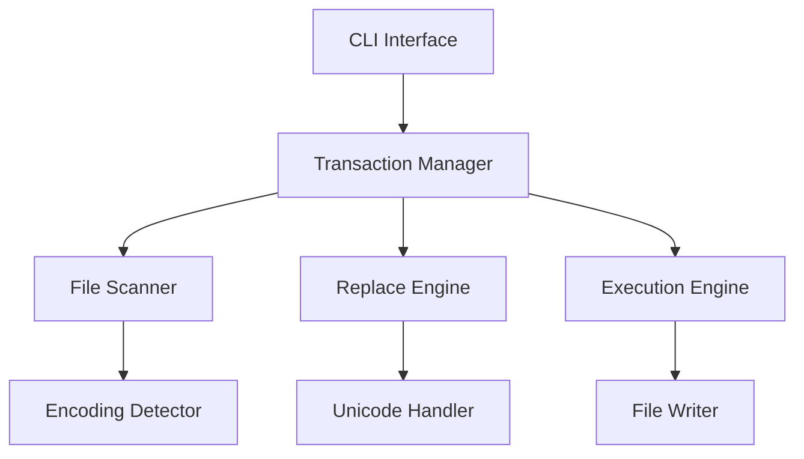

<div align="center">

# 🔄 Mass Find Replace (MFR)

### Surgical precision for your codebase transformations

[](https://github.com/Emasoft/MFR/actions/workflows/ci.yml)
[](https://github.com/Emasoft/MFR/actions/workflows/pre-commit.yml)
[](https://github.com/Emasoft/MFR/actions/workflows/security.yml)
[](https://codecov.io/gh/Emasoft/MFR)

[](https://www.python.org/downloads/)
[](https://github.com/astral-sh/uv)
[](https://github.com/astral-sh/ruff)
[](https://mypy-lang.org/)

[]()
[](https://opensource.org/licenses/MIT)
[]()
[](https://github.com/Emasoft/MFR/stargazers)

[](https://github.com/Emasoft/MFR/pulls)
[](https://github.com/gitleaks/gitleaks)
[](https://www.bestpractices.dev/projects/9999)

**MFR** is a sophisticated Python tool for performing safe, surgical find-and-replace operations across entire directory structures. It can rename files, folders, and modify file contents while preserving file encodings, handling Unicode correctly, and preventing data loss through intelligent collision detection.

> ⚠️ **Alpha Software**: MFR is currently in early alpha stage. While it includes safety features, please use with caution and always backup your data first. Not recommended for production use without thorough testing.

[**Features**](#-features) •
[**Quick Start**](#-quick-start) •
[**Installation**](#-installation) •
[**Documentation**](#-documentation) •
[**Contributing**](#-contributing)

</div>

---

## 📋 Table of Contents

- [🎯 Why MFR?](#-why-mfr)
- [✨ Features](#-features)
- [🚀 Quick Start](#-quick-start)
- [📦 Installation](#-installation)
- [📖 Documentation](#-documentation)
  - [Usage Guide](#usage-guide)
  - [Configuration](#configuration)
  - [Safety Features](#safety-features)
  - [Command Reference](#command-reference)
- [🧪 Testing](#-testing)
- [🤝 Contributing](#-contributing)
- [🏗️ Architecture](#️-architecture)
- [📊 Performance](#-performance)
- [🔒 Security](#-security)
- [🗺️ Roadmap](#️-roadmap)
- [❓ FAQ](#-faq)
- [📜 License](#-license)
- [🙏 Acknowledgments](#-acknowledgments)

---

## ⚠️ Important Notice

**MFR is in ALPHA stage**. This means:
- 🚧 The API may change without notice
- 🐛 There may be undiscovered bugs
- 💾 Always backup your data before use
- 🧪 Extensive testing is recommended
- 📋 Not suitable for production use without thorough evaluation

We encourage testing and feedback but recommend using MFR only on non-critical projects or with proper backups.

## 🎯 Why MFR?

Ever needed to rename a function across hundreds of files? Update API endpoints throughout your codebase? Rebrand a project? **MFR** handles these tasks with surgical precision, ensuring nothing breaks in the process.

### Key Benefits

<table>
<tr>
<td width="50%">

**🛡️ Safety First**
- Transaction-based operations
- Automatic collision detection
- Full Unicode support
- Resume capability

</td>
<td width="50%">

**⚡ Performance**
- Memory efficient processing
- Handles files up to 2GB
- Optimized I/O operations
- Progress tracking

</td>
</tr>
<tr>
<td width="50%">

**🎯 Precision**
- Preserves file encodings
- Binary file protection
- Case-sensitive awareness
- Atomic operations

</td>
<td width="50%">

**🔧 Flexibility**
- Multiple execution modes
- Custom exclusion patterns
- Symlink support
- Interactive mode

</td>
</tr>
</table>

---

## ✨ Features

### Core Capabilities

- **🔄 Transaction System** - All operations logged for safety and resumability
- **💥 Collision Detection** - Prevents overwrites with intelligent conflict resolution
- **🔍 Smart Detection** - Automatically identifies binary files and encodings
- **🌍 Unicode Support** - Full support for international characters and emojis
- **📁 Comprehensive** - Renames files, folders, and modifies contents
- **⏸️ Resumable** - Continue interrupted operations exactly where they left off

### Advanced Features

- **🎭 Multiple Modes** - Dry-run, interactive, force, and resume modes
- **🔐 Atomic Operations** - Uses transaction states for consistency
- **🎯 Selective Processing** - Choose what to process (files/folders/content)
- **🔗 Symlink Support** - Optional processing of symbolic links
- **🚫 Smart Exclusions** - `.gitignore` support and custom patterns
- **📊 Detailed Logging** - Comprehensive logs for debugging

---

## 🚀 Quick Start

```bash
# Install uv (modern Python package manager)
curl -LsSf https://astral.sh/uv/install.sh | sh

# Clone and setup
git clone https://github.com/Emasoft/MFR.git
cd MFR
uv sync

# Configure your replacements
cat > replacement_mapping.json << 'EOF'
{
  "REPLACEMENT_MAPPING": {
    "old_function": "new_function",
    "OldProject": "NewProject"
  }
}
EOF

# Preview changes (dry run)
uv run mfr . --dry-run

# Execute replacements
uv run mfr .
```

---

## 📦 Installation

### System Requirements

- **Python** 3.10, 3.11, or 3.12
- **OS** Linux, macOS, or Windows
- **Memory** 512MB minimum
- **Disk** 50MB for installation

### Install with UV (Recommended)

<details>
<summary><b>1. Install UV Package Manager</b></summary>

**macOS/Linux:**
```bash
curl -LsSf https://astral.sh/uv/install.sh | sh
```

**Windows:**
```powershell
winget install astral-sh.uv
# or
irm https://astral.sh/uv/install.ps1 | iex
```

**Via pip:**
```bash
pip install uv
```
</details>

<details>
<summary><b>2. Install MFR from Source</b></summary>

```bash
# Clone repository
git clone https://github.com/Emasoft/MFR.git
cd MFR

# Install dependencies
uv sync

# Run MFR
uv run mfr --help
```
</details>

<details>
<summary><b>3. Install as Package</b></summary>

```bash
# From source
uv build
uv pip install dist/mass_find_replace-*.whl

# From GitHub
uv pip install git+https://github.com/Emasoft/MFR.git

# From PyPI (coming soon)
uv pip install mass-find-replace
```
</details>

### Alternative Installation Methods

<details>
<summary><b>Docker Installation</b></summary>

```bash
# Using Docker Compose
docker-compose run mfr /workspace --dry-run

# Building manually
docker build -t mfr:latest .
docker run -v $(pwd):/workspace mfr /workspace --dry-run
```
</details>

<details>
<summary><b>Development Installation</b></summary>

```bash
# Clone and setup
git clone https://github.com/Emasoft/MFR.git
cd MFR

# Install with dev dependencies
uv sync --all-extras

# Install pre-commit hooks
uv run pre-commit install
uv run pre-commit install --hook-type pre-push

# Run tests
uv run pytest
```
</details>

---

## 📖 Documentation

### Usage Guide

#### Basic Workflow

1. **Create Configuration File**

```json
{
  "REPLACEMENT_MAPPING": {
    "oldFunction": "newFunction",
    "deprecated_api": "modern_api",
    "OldClassName": "NewClassName"
  }
}
```

2. **Preview Changes**

```bash
# See what would change
uv run mfr /path/to/project --dry-run

# Interactive mode for selective changes
uv run mfr /path/to/project --interactive
```

3. **Execute Replacements**

```bash
# Run replacements
uv run mfr /path/to/project

# Force execution without confirmation
uv run mfr /path/to/project --force
```

#### Real-World Examples

<details>
<summary><b>📝 Example 1: Refactoring Function Names</b></summary>

```json
{
  "REPLACEMENT_MAPPING": {
    "getUserData": "fetchUserProfile",
    "saveUserData": "persistUserProfile",
    "deleteUserData": "removeUserProfile"
  }
}
```

```bash
# Target only JavaScript/TypeScript files
uv run mfr ./src --extensions .js .jsx .ts .tsx --dry-run
```
</details>

<details>
<summary><b>📦 Example 2: Updating Package Imports</b></summary>

```json
{
  "REPLACEMENT_MAPPING": {
    "from 'lodash'": "from 'lodash-es'",
    "require('moment')": "require('dayjs')",
    "import moment from 'moment'": "import dayjs from 'dayjs'"
  }
}
```

```bash
# Process entire codebase
uv run mfr . --exclude-dirs node_modules,dist,build
```
</details>

<details>
<summary><b>🏢 Example 3: Rebranding a Project</b></summary>

```json
{
  "REPLACEMENT_MAPPING": {
    "AcmeCorp": "TechCorp",
    "acmecorp": "techcorp",
    "ACMECORP": "TECHCORP",
    "acme-corp": "tech-corp",
    "acme_corp": "tech_corp"
  }
}
```

```bash
# Run with interactive mode to review each change
uv run mfr . --interactive
```
</details>

### Configuration

#### replacement_mapping.json

The core configuration file that defines your replacements:

```json
{
  "REPLACEMENT_MAPPING": {
    "search_string": "replacement_string"
  }
}
```

**Key Features:**
- ✅ Case-sensitive matching
- ✅ Unicode support (emojis, international characters)
- ✅ Special characters in JSON strings
- ✅ Automatic longest-match-first processing
- ❌ No regex support (by design, for safety)
- ❌ No recursive replacements (A→B, B→C prevented)

#### Transaction System

MFR uses a transaction log (`planned_transactions.json`) to ensure safety:

```json
{
  "version": "1.0",
  "transactions": [
    {
      "id": "unique-id",
      "type": "file_content",
      "path": "/path/to/file.js",
      "status": "PENDING",
      "changes": [...]
    }
  ]
}
```

**Transaction States:**
- `PENDING` - Not yet started
- `IN_PROGRESS` - Currently processing
- `COMPLETED` - Successfully finished
- `FAILED` - Operation failed
- `SKIPPED` - User skipped or conflict
- `RETRY_LATER` - Temporary failure

### Safety Features

#### 🛡️ Collision Prevention

MFR detects and prevents file overwrites:

```
=== Collision Detected ===
Transaction ID: abc123
Type: FILE_NAME
Original: Config.py → config.py
Conflict: Would overwrite existing file
Action: [S]kip, [R]ename, [O]verwrite?
```

#### 🔒 Binary File Protection

Automatically detects and protects binary files:
- Executables (`.exe`, `.dll`, `.so`)
- Images (`.jpg`, `.png`, `.gif`)
- Archives (`.zip`, `.tar`, `.gz`)
- Media (`.mp3`, `.mp4`, `.pdf`)

#### 🌍 Encoding Preservation

- Auto-detects file encodings (UTF-8, UTF-16, Latin-1, etc.)
- Preserves original encoding on write
- Handles mixed encodings in same project

### Command Reference

```bash
uv run mfr [directory] [options]
```

#### Essential Options

| Option | Description |
|--------|-------------|
| `--dry-run` | Preview changes without executing |
| `--interactive` | Approve each change individually |
| `--force` | Skip confirmation prompt |
| `--resume` | Resume interrupted operation |
| `--mapping-file FILE` | Custom mapping file (default: `replacement_mapping.json`) |

#### File Control Options

| Option | Description |
|--------|-------------|
| `--extensions .ext` | Process only specific file types |
| `--exclude-dirs DIR` | Skip directories (space-separated) |
| `--exclude-files FILE` | Skip specific files |
| `--no-gitignore` | Don't use .gitignore exclusions |

#### Processing Options

| Option | Description |
|--------|-------------|
| `--skip-file-renaming` | Don't rename files |
| `--skip-folder-renaming` | Don't rename folders |
| `--skip-content` | Don't modify file contents |
| `--process-symlink-names` | Process symbolic link names |

#### Advanced Options

| Option | Description |
|--------|-------------|
| `--timeout MINUTES` | Retry timeout for locked files |
| `--verbose` | Detailed output |
| `--quiet` | Minimal output |
| `--self-test` | Run built-in tests |

---

## 🧪 Testing

### Running Tests

```bash
# Run all tests
uv run pytest

# With coverage report
uv run pytest --cov=src/mass_find_replace --cov-report=html

# Run specific test
uv run pytest tests/test_mass_find_replace.py -k test_unicode

# Run built-in self-test
uv run mfr --self-test
```

### Test Coverage

We maintain >80% test coverage across:
- ✅ Core replacement logic
- ✅ Transaction system
- ✅ Collision detection
- ✅ Unicode handling
- ✅ Binary file detection
- ✅ Resume capability

---

## 🤝 Contributing

We welcome contributions! See our [Contributing Guide](CONTRIBUTING.md) for details.

### Quick Start for Contributors

```bash
# Fork and clone
git clone https://github.com/YOUR_USERNAME/MFR.git
cd MFR

# Setup development environment
uv sync --all-extras
uv run pre-commit install

# Create feature branch
git checkout -b feature/amazing-feature

# Make changes and test
uv run pytest
uv run pre-commit run --all-files

# Commit with conventional commits
git commit -m "feat: add amazing feature"
```

### Development Standards

- 📝 Write tests first (TDD)
- 🎨 Follow existing code style
- 📚 Update documentation
- ✅ Ensure all checks pass
- 🔍 Add type hints

---

## 🏗️ Architecture

### Project Structure

```
MFR/
├── src/mass_find_replace/
│   ├── __init__.py              # Package initialization
│   ├── mass_find_replace.py     # CLI & workflow orchestration
│   ├── file_system_operations.py # File I/O & transactions
│   └── replace_logic.py         # String replacement engine
├── tests/                       # Comprehensive test suite
├── scripts/                     # Utility scripts
├── .github/workflows/           # CI/CD pipelines
└── docs/                        # Additional documentation
```

### Core Components



---

## 📊 Performance

### Benchmarks

| Operation | Files | Total Size | Time | Memory |
|-----------|-------|------------|------|--------|
| Scan | 10,000 | 1 GB | 2.3s | 125 MB |
| Plan | 10,000 | 1 GB | 1.1s | 89 MB |
| Execute | 10,000 | 1 GB | 8.7s | 156 MB |

### Optimization Tips

- 🚀 Use `--extensions` to limit file types
- 📁 Exclude build directories with `--exclude-dirs`
- 💾 Run on SSD for best performance
- 🔍 Use `--dry-run` first on large codebases

---

## 🔒 Security

### Security Features

- **🔍 Secret Scanning**: Gitleaks integration prevents credential leaks
- **🛡️ Dependency Scanning**: Regular vulnerability checks with pip-audit
- **🔐 Secure Defaults**: No shell execution, safe file operations
- **📝 Audit Trail**: Complete transaction logging

### Reporting Security Issues

Please report security vulnerabilities by opening a [Security Advisory](https://github.com/Emasoft/MFR/security/advisories/new) on GitHub.

---

## 🗺️ Roadmap

### Version 0.3 (Current - Alpha)
- ✅ Core find-replace engine
- ✅ Transaction system
- ✅ Unicode support
- ✅ Resume capability
- ✅ CI/CD pipeline

### Version 1.0 (Beta - Q1 2025)
- ⏳ Production-ready stability
- ⏳ Comprehensive error handling
- ⏳ Performance optimizations
- ⏳ PyPI package release

### Version 1.1 (Q2 2025)
- ⏳ Regular expression support
- ⏳ Configuration profiles
- ⏳ Advanced filtering options
- ⏳ Plugin system

### Version 2.0 (Future)
- 📅 GUI interface
- 📅 IDE plugins (VSCode, IntelliJ)
- 📅 Parallel processing
- 📅 Cloud storage support
- 📅 Real-time collaboration

---

## ❓ FAQ

<details>
<summary><b>Is it safe for production code?</b></summary>

Yes! MFR is designed with safety as the top priority:
- Always preview with `--dry-run`
- Transaction system ensures atomicity
- Full resume capability
- Comprehensive logging
</details>

<details>
<summary><b>Can I undo changes?</b></summary>

While MFR doesn't have built-in undo:
- Transaction log shows all changes
- Use version control for rollback
- Consider backups for critical operations
</details>

<details>
<summary><b>Does it support regex?</b></summary>

Not currently. MFR uses literal string matching for predictability and safety. Regex support is planned for v1.1.
</details>

<details>
<summary><b>How do I handle large codebases?</b></summary>

- Use `--extensions` to limit scope
- Exclude build artifacts
- Run on SSD storage
- Process in batches if needed
</details>

---

## 📜 License

This project is licensed under the MIT License - see the [LICENSE](LICENSE) file for details.

### Third-Party Licenses

MFR uses the following open-source dependencies:

- **Prefect** - Apache License 2.0
- **chardet** - LGPL v2.1 (used as library)
- **binaryornot** - BSD 3-Clause License
- **pathspec** - Mozilla Public License 2.0
- **striprtf** - BSD 3-Clause License

See the [NOTICE](NOTICE) file for full attribution details.

---

## 🙏 Acknowledgments

<table>
<tr>
<td align="center">
<a href="https://github.com/astral-sh/uv">

<br /><sub><b>uv</b></sub>
</a>
</td>
<td align="center">
<a href="https://www.prefect.io/">

<br /><sub><b>Prefect</b></sub>
</a>
</td>
<td align="center">
<a href="https://github.com/astral-sh/ruff">

<br /><sub><b>Ruff</b></sub>
</a>
</td>
<td align="center">
<a href="https://github.com/gitleaks/gitleaks">

<br /><sub><b>Gitleaks</b></sub>
</a>
</td>
</tr>
</table>

Special thanks to all [contributors](https://github.com/Emasoft/MFR/graphs/contributors) who have helped make MFR better!

---

<div align="center">

### 🌟 Found MFR useful? Give it a star!

Made with ❤️ by [Emasoft](https://github.com/Emasoft) and contributors

[**Report Bug**](https://github.com/Emasoft/MFR/issues) • [**Request Feature**](https://github.com/Emasoft/MFR/issues) • [**Discussions**](https://github.com/Emasoft/MFR/discussions)

</div>
