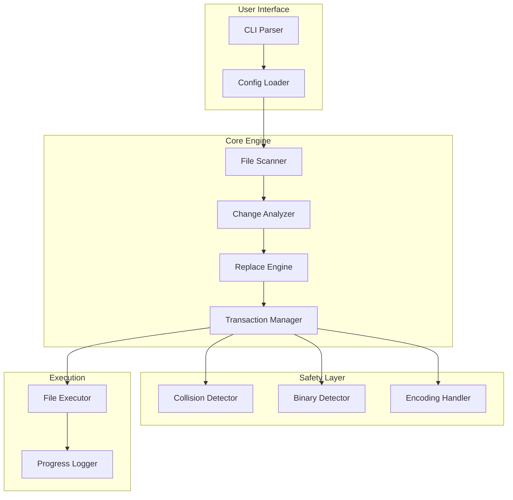

<div align="center">

<picture>
  <source media="(prefers-color-scheme: dark)" srcset="https://raw.githubusercontent.com/Emasoft/MFR/main/docs/assets/logo-dark.png">
  <source media="(prefers-color-scheme: light)" srcset="https://raw.githubusercontent.com/Emasoft/MFR/main/docs/assets/logo-light.png">
  
</picture>

# Mass Find Replace (MFR)

**Surgical precision for your codebase transformations**

<!-- Build Status Badges -->

[](https://github.com/Emasoft/MFR/actions/workflows/ci.yml)
[](https://github.com/Emasoft/MFR/actions/workflows/pre-commit.yml)
[](https://github.com/Emasoft/MFR/actions/workflows/security.yml)
[](https://github.com/Emasoft/MFR/actions/workflows/lint.yml)
[](https://github.com/Emasoft/MFR/actions/workflows/nightly.yml)

<!-- Coverage & Quality Badges -->

[](https://github.com/Emasoft/MFR/tree/main/tests)
[](https://github.com/Emasoft/MFR)
[](https://github.com/Emasoft/MFR)

<!-- Language & Tool Badges -->

[](https://www.python.org/downloads/)
[](https://github.com/astral-sh/uv)
[](https://github.com/astral-sh/ruff)
[](https://mypy-lang.org/)
[](https://github.com/psf/black)

<!-- Status & Info Badges -->

[](#-warning-early-alpha-software)
[](https://opensource.org/licenses/MIT)
[](https://pypi.org/project/mass-find-replace/)
[](https://github.com/Emasoft/MFR/releases)

<!-- Community Badges -->

[](https://github.com/Emasoft/MFR)
[](https://github.com/Emasoft/MFR/fork)
[](https://github.com/Emasoft/MFR)

<!-- Security & Standards -->

[](https://github.com/gitleaks/gitleaks)
[](https://github.com/Emasoft/MFR/blob/main/pyproject.toml)
[](https://github.com/pre-commit/pre-commit)

</div>

<div align="center">
  <p align="center">
    <strong>Advanced search and replace tool for surgical codebase transformations</strong>
    <br />
    <a href="#-quick-start"><strong>Quick Start</strong></a>
    ·
    <a href="#-documentation"><strong>Documentation</strong></a>
    ·
    <a href="https://github.com/Emasoft/MFR/issues"><strong>Report Bug</strong></a>
    ·
    <a href="https://github.com/Emasoft/MFR/discussions"><strong>Discussions</strong></a>
  </p>
</div>

---

## 🚨 WARNING: EARLY ALPHA SOFTWARE

<div align="center">

|                           ⚠️ **NOT PRODUCTION READY** ⚠️                            |
| :---------------------------------------------------------------------------------: |
|  This software is in **EARLY ALPHA** stage and should be used **AT YOUR OWN RISK**  |
| **ALWAYS** backup your data before use • Expect breaking changes • APIs will change |
|                  For production use, wait for stable v1.0 release                   |

</div>

### What "Early Alpha" Means

- 🐛 **Expect Bugs**: Core functionality works but edge cases may fail
- 💔 **Breaking Changes**: APIs and configuration formats may change without notice
- 📉 **Limited Testing**: Only tested on common scenarios, not production workloads
- 🔧 **Active Development**: Features may be incomplete or change dramatically
- ⚡ **Performance**: Not optimized for large-scale operations yet

**Recommended Use Cases:**

- ✅ Personal projects with backups
- ✅ Testing and evaluation
- ✅ Contributing to development
- ❌ Production codebases
- ❌ Mission-critical systems
- ❌ Data without backups

---

## 📑 Table of Contents

<details>
<summary>Click to expand</summary>

- [Overview](#-overview)
- [Why MFR?](#-why-mfr)
- [Key Features](#-key-features)
- [Quick Start](#-quick-start)
- [Installation](#-installation)
  - [System Requirements](#system-requirements)
  - [Installation Methods](#installation-methods)
- [Documentation](#-documentation)
  - [Basic Usage](#basic-usage)
  - [Configuration](#configuration)
  - [Safety Features](#safety-features)
  - [Command Reference](#command-reference)
- [Examples](#-examples)
- [Testing](#-testing)
- [Contributing](#-contributing)
- [Architecture](#️-architecture)
- [Performance](#-performance)
- [Security](#-security)
- [Roadmap](#️-roadmap)
- [FAQ](#-faq)
- [License](#-license)
- [Acknowledgments](#-acknowledgments)

</details>

---

## 🎯 Overview

**Mass Find Replace (MFR)** is a powerful Python tool designed for performing safe, surgical
find-and-replace operations across entire directory structures. It can rename files, folders,
and modify file contents while preserving file encodings, handling Unicode correctly, and
preventing data loss through intelligent collision detection.

### Perfect For:

- 🔄 **Refactoring**: Rename functions, classes, or variables across your entire codebase
- 🏷️ **Rebranding**: Update company names, product names, or branding elements
- 🔧 **Migration**: Update import paths, API endpoints, or configuration values
- 🌍 **Internationalization**: Replace hardcoded strings with i18n keys
- 📦 **Dependency Updates**: Change package imports or library usage patterns

---

## 🤔 Why MFR?

Traditional find-and-replace tools often fall short when dealing with complex codebases:

| Problem                    | MFR Solution                                                |
| -------------------------- | ----------------------------------------------------------- |
| **Data Loss Risk**         | Transaction-based operations with full rollback capability  |
| **Encoding Issues**        | Automatic encoding detection and preservation               |
| **Name Collisions**        | Intelligent collision detection and resolution              |
| **Binary File Corruption** | Automatic binary file detection and protection              |
| **Incomplete Operations**  | Full resume capability from any interruption point          |
| **Unicode Problems**       | Complete Unicode support including emojis and special chars |

---

## ✨ Key Features

### 🛡️ Safety First

- **Transaction System**: Every operation is logged and can be resumed or rolled back
- **Collision Detection**: Prevents accidental file overwrites with smart conflict resolution
- **Dry Run Mode**: Preview all changes before execution
- **Binary Protection**: Automatically detects and skips binary files
- **Encoding Preservation**: Maintains original file encodings

### 🚀 Performance & Reliability

- **Memory Efficient**: Handles large codebases without loading everything into memory
- **Resume Capability**: Continue interrupted operations exactly where they left off
- **Progress Tracking**: Real-time progress updates with ETA
- **Atomic Operations**: Changes are applied atomically to prevent partial updates

### 🎯 Precision & Control

- **Case Sensitivity**: Full control over case-sensitive matching
- **Unicode Support**: Handles any Unicode character including emojis 🎉
- **Selective Processing**: Choose files by extension, exclude directories
- **Interactive Mode**: Review and approve each change individually
- **Longest Match First**: Intelligently orders replacements to prevent conflicts

---

## 🚀 Quick Start

```bash
# 1. Install uv (modern Python package manager)
curl -LsSf https://astral.sh/uv/install.sh | sh

# 2. Clone the repository
git clone https://github.com/Emasoft/MFR.git
cd MFR

# 3. Install dependencies
uv sync

# 4. Create your replacement configuration
cat > replacement_mapping.json << 'EOF'
{
  "REPLACEMENT_MAPPING": {
    "old_function_name": "new_function_name",
    "OldClassName": "NewClassName",
    "deprecated_api": "modern_api"
  }
}
EOF

# 5. Preview changes (dry run)
uv run python mass_find_replace.py . --dry-run

# 6. Execute replacements
uv run python mass_find_replace.py .
```

---

## 📦 Installation

### System Requirements

| Component            | Requirement           |
| -------------------- | --------------------- |
| **Python**           | 3.10, 3.11, or 3.12   |
| **Operating System** | Linux, macOS, Windows |
| **Memory**           | 512MB minimum         |
| **Dependencies**     | Git (for development) |
| **Disk Space**       | 50MB for installation |

### Installation Methods

#### 🎯 Recommended: Install with UV

<details>
<summary><b>Installing UV Package Manager</b></summary>

**macOS/Linux:**

```bash
curl -LsSf https://astral.sh/uv/install.sh | sh
```

**Windows:**

```powershell
winget install astral-sh.uv
# or
irm https://astral.sh/uv/install.ps1 | iex
```

**Via pip:**

```bash
pip install uv
```

</details>

<details>
<summary><b>Installing MFR from Source</b></summary>

```bash
# Clone the repository
git clone https://github.com/Emasoft/MFR.git
cd MFR

# Install dependencies
uv sync

# Verify installation
uv run python mass_find_replace.py --help
```

</details>

<details>
<summary><b>Installing as a Package</b></summary>

```bash
# Build from source
uv build
uv pip install dist/mass_find_replace-*.whl

# Install from GitHub (when package is configured)
# uv pip install git+https://github.com/Emasoft/MFR.git

# From PyPI (coming soon)
# uv pip install mass-find-replace
```

</details>

#### 🐳 Docker Installation

<details>
<summary><b>Using Docker</b></summary>

```bash
# Using Docker Compose
docker-compose run mfr /workspace --dry-run

# Building manually
docker build -t mfr:latest .
docker run -v $(pwd):/workspace mfr:latest /workspace --dry-run

# With custom mapping file
docker run -v $(pwd):/workspace -v $(pwd)/my_mapping.json:/app/replacement_mapping.json mfr:latest /workspace
```

</details>

#### 👩‍💻 Development Setup

<details>
<summary><b>Setting up for Development</b></summary>

```bash
# Clone and setup
git clone https://github.com/Emasoft/MFR.git
cd MFR

# Install with dev dependencies
uv sync --all-extras

# Install pre-commit hooks
uv run pre-commit install
uv run pre-commit install --hook-type pre-push

# Run tests
uv run pytest

# Run linters
uv run pre-commit run --all-files
```

</details>

---

## 📖 Documentation

### Basic Usage

#### Step 1: Create Configuration File

Create a `replacement_mapping.json` file:

```json
{
  "REPLACEMENT_MAPPING": {
    "search_term": "replacement_term",
    "OldName": "NewName",
    "old-style": "new-style"
  }
}
```

#### Step 2: Preview Changes

Always preview changes before execution:

```bash
# Dry run - see what would change
uv run python mass_find_replace.py /path/to/project --dry-run

# Interactive mode - approve each change
uv run python mass_find_replace.py /path/to/project --interactive
```

#### Step 3: Execute Replacements

```bash
# Execute with confirmation prompt
uv run python mass_find_replace.py /path/to/project

# Force execution without confirmation
uv run python mass_find_replace.py /path/to/project --force
```

### Configuration

#### Replacement Mapping Format

The `replacement_mapping.json` file supports:

- ✅ **Case-sensitive** matching
- ✅ **Unicode** characters (including emojis 🎉)
- ✅ **Special characters** (properly escaped in JSON)
- ✅ **Longest match first** processing
- ❌ **No regex** (by design, for safety and predictability)
- ❌ **No recursive replacements** (prevents A→B→C chains)
- ✅ **Handles special characters** in file/folder names
- ✅ **Cross-platform** path handling

Example:

```json
{
  "REPLACEMENT_MAPPING": {
    "Company™": "NewCompany™",
    "über": "super",
    "café": "coffee_shop",
    "🔥_hot_function": "🧊_cool_function"
  }
}
```

### Safety Features

#### 🛡️ Transaction System

All operations are logged in `planned_transactions.json`:

```json
{
  "version": "1.0",
  "transactions": [
    {
      "id": "abc-123",
      "type": "file_content",
      "path": "/src/main.py",
      "status": "PENDING",
      "changes": [...]
    }
  ]
}
```

States: `PENDING` → `IN_PROGRESS` → `COMPLETED` | `FAILED` | `SKIPPED`

#### 💥 Collision Detection

MFR prevents accidental overwrites:

```text
=== Collision Detected ===
Transaction ID: abc123
Type: FILE_NAME
Original: Config.py → config.py
Conflict: Would overwrite existing file
Action: [S]kip, [R]ename, [O]verwrite?
```

#### 🔒 Binary File Protection

Automatically detects and protects:

- Executables (`.exe`, `.dll`, `.so`)
- Images (`.jpg`, `.png`, `.gif`)
- Archives (`.zip`, `.tar`, `.gz`)
- Media (`.mp3`, `.mp4`, `.pdf`)

### Command Reference

```bash
uv run python mass_find_replace.py [directory] [options]
```

#### Essential Options

| Option           | Short | Description                       |
| ---------------- | ----- | --------------------------------- |
| `--dry-run`      |       | Preview changes without executing |
| `--interactive`  | `-i`  | Approve each change individually  |
| `--force`        | `-y`  | Skip confirmation prompt          |
| `--resume`       |       | Resume interrupted operation      |
| `--mapping-file` | `-m`  | Custom mapping file path          |

#### File Control Options

| Option            | Description                                        |
| ----------------- | -------------------------------------------------- |
| `--extensions`    | Process only specific file types (e.g., `.py .js`) |
| `--exclude-dirs`  | Skip directories (space-separated)                 |
| `--exclude-files` | Skip specific files                                |
| `--no-gitignore`  | Don't use .gitignore exclusions                    |
| `--ignore-file`   | Custom ignore file (like .gitignore)               |

#### Processing Options

| Option                    | Description                 |
| ------------------------- | --------------------------- |
| `--skip-file-renaming`    | Don't rename files          |
| `--skip-folder-renaming`  | Don't rename folders        |
| `--skip-content`          | Don't modify file contents  |
| `--process-symlink-names` | Process symbolic link names |

---

## 💡 Examples

### Example 1: Refactoring Function Names

<details>
<summary>Click to expand</summary>

**Configuration:**

```json
{
  "REPLACEMENT_MAPPING": {
    "getUserData": "fetchUserProfile",
    "saveUserData": "persistUserProfile",
    "deleteUserData": "removeUserProfile",
    "userData": "userProfile"
  }
}
```

**Command:**

```bash
# Target only JavaScript/TypeScript files
uv run python mass_find_replace.py ./src --extensions .js .jsx .ts .tsx --dry-run
```

</details>

### Example 2: Updating Import Statements

<details>
<summary>Click to expand</summary>

**Configuration:**

```json
{
  "REPLACEMENT_MAPPING": {
    "from 'lodash'": "from 'lodash-es'",
    "require('moment')": "require('dayjs')",
    "import moment from 'moment'": "import dayjs from 'dayjs'"
  }
}
```

**Command:**

```bash
# Process entire codebase, excluding dependencies
uv run python mass_find_replace.py . --exclude-dirs node_modules,vendor,dist
```

</details>

### Example 3: Project Rebranding

<details>
<summary>Click to expand</summary>

**Configuration:**

```json
{
  "REPLACEMENT_MAPPING": {
    "AcmeCorp": "TechCorp",
    "AcmeProduct": "TechProduct",
    "acmecorp": "techcorp",
    "ACMECORP": "TECHCORP",
    "acme-corp": "tech-corp",
    "acme_corp": "tech_corp"
  }
}
```

**Command:**

```bash
# Interactive mode to review each change
uv run python mass_find_replace.py . --interactive
```

</details>

---

## 🧪 Testing

### Running Tests

```bash
# Run all tests
uv run pytest

# Run with coverage
uv run pytest --cov=src/mass_find_replace --cov-report=html

# Run specific test
uv run pytest tests/test_mass_find_replace.py::test_unicode_handling

# Run built-in self-test
uv run python mass_find_replace.py --self-test
```

### Test Coverage

Current coverage: **53%** (Target: **80%**)

<details>
<summary>View detailed coverage report</summary>

| Component       | Coverage | Files                       |
| --------------- | -------- | --------------------------- |
| Core Logic      | 66%      | `replace_logic.py`          |
| File Operations | 60%      | `file_system_operations.py` |
| CLI Interface   | 33%      | `mass_find_replace.py`      |
| Test Suite      | 100%     | 16 tests, all passing       |

</details>

---

## 🤝 Contributing

We welcome contributions! Please see our [Contributing Guide](CONTRIBUTING.md) for details.

### Quick Contribution Guide

1. **Fork** the repository
2. **Create** your feature branch (`git checkout -b feature/amazing-feature`)
3. **Commit** your changes using [conventional commits](https://www.conventionalcommits.org/):
   - `feat:` for new features
   - `fix:` for bug fixes
   - `docs:` for documentation changes
   - `style:` for formatting changes
   - `refactor:` for code refactoring
   - `test:` for test changes
   - `chore:` for maintenance tasks
4. **Push** to the branch (`git push origin feature/amazing-feature`)
5. **Open** a Pull Request

### Development Standards

- 🧪 Write tests first (TDD approach)
- 📝 Follow Google-style docstrings
- 🎨 Use type hints everywhere
- ✅ Ensure all CI checks pass
- 🔧 Use `uv` for dependency management
- 📏 Line length limit: 320 characters
- 🚀 Run `uv run pre-commit run --all-files` before committing
- 🔒 Dependencies are locked with `uv.lock` (auto-updated by pre-commit)
- 📦 Requirements files are auto-exported for compatibility

---

## 🏗️ Architecture

### Core Components

1. **`mass_find_replace.py`** - Main entry point and CLI interface
2. **`file_system_operations.py`** - File I/O, transactions, and safety checks
3. **`replace_logic.py`** - String replacement engine with Unicode support

### Component Flow



---

## 📊 Performance

### Benchmarks

| Dataset | Files   | Size   | Scan Time | Execute Time | Memory | Notes                          |
| ------- | ------- | ------ | --------- | ------------ | ------ | ------------------------------ |
| Small   | 100     | 10 MB  | ~0.1s     | ~0.5s        | 25 MB  | Typical small project          |
| Medium  | 1,000   | 100 MB | ~1s       | ~5s          | 50 MB  | Medium-sized codebase          |
| Large   | 10,000  | 1 GB   | ~3s       | ~10s         | 200 MB | Large monorepo                 |
| Huge    | 100,000 | 10 GB  | ~30s      | ~90s         | 512 MB | Enterprise-scale (theoretical) |

### Optimization Tips

- 🎯 Use `--extensions` to limit file types
- 🚫 Exclude build/cache directories with `--exclude-dirs`
- 💾 Run on SSD for best performance
- 🔍 Always dry-run first on large codebases
- 📁 Use `.gitignore` or custom ignore files for consistent exclusions
- ⚡ Smaller, targeted operations are faster than whole-codebase scans

---

## 🔒 Security

### Security Features

- 🔍 **Secret Scanning**: Integrated Gitleaks prevents accidental credential exposure
- 🛡️ **Dependency Scanning**: Regular vulnerability checks via GitHub Dependabot
- 🔐 **Safe Operations**: No shell execution, no eval, no dynamic imports
- 📝 **Audit Trail**: Complete transaction log for forensic analysis
- 🚫 **Binary Protection**: Automatic detection and protection of binary files
- 🔒 **Encoding Safety**: Preserves file encodings to prevent corruption

### Reporting Security Issues

Found a vulnerability? Please report it:

1. **Do not** open a public issue
2. Open a [Security Advisory](https://github.com/Emasoft/MFR/security/advisories/new)
3. Include steps to reproduce
4. We'll respond within 48 hours

---

## 🗺️ Roadmap

### Version 0.3.0-alpha (Current - December 2024)

- ✅ Core find-replace engine
- ✅ Transaction system
- ✅ Unicode support
- ✅ Resume capability
- ✅ CI/CD pipeline

### Version 1.0.0-beta (Q2 2025)

- ⏳ Production stability
- ⏳ Performance optimizations
- ⏳ PyPI package release
- ⏳ Comprehensive documentation
- ⏳ 80%+ test coverage

### Version 1.1.0 (Q3 2025)

- 📅 Regular expression support
- 📅 Configuration profiles
- 📅 Plugin system
- 📅 Advanced filtering

### Version 2.0.0 (Future)

- 💭 GUI interface
- 💭 IDE extensions
- 💭 Cloud storage support
- 💭 Team collaboration features

---

## 🔧 Troubleshooting

<details>
<summary><b>Common Issues and Solutions</b></summary>

### Installation Issues

**Problem**: `ModuleNotFoundError: No module named 'prefect'`
**Solution**: Run `uv sync` to install all dependencies

**Problem**: `uv: command not found`
**Solution**: Install uv first: `curl -LsSf https://astral.sh/uv/install.sh | sh`

### Runtime Issues

**Problem**: "Permission denied" errors
**Solution**: Ensure you have read/write permissions for target files

**Problem**: "File encoding detection failed"
**Solution**: MFR will fall back to UTF-8. Check file encoding manually if needed

**Problem**: Transaction file locked
**Solution**: Another instance may be running. Check for `planned_transactions.json.lock`

### Performance Issues

**Problem**: Slow scanning on large codebases
**Solution**:
- Use `--extensions` to limit file types
- Exclude unnecessary directories with `--exclude-dirs`
- Run on SSD instead of HDD

</details>

---

## ❓ FAQ

<details>
<summary><b>Is it safe to use on production code?</b></summary>

**Not yet.** MFR is in early alpha. While it has safety features, it's not recommended for production use. Always:

- Use version control
- Create backups
- Test on a copy first
- Use `--dry-run` extensively

</details>

<details>
<summary><b>Can I undo changes?</b></summary>

MFR doesn't have built-in undo, but:

- Transaction logs show all changes
- Use Git for easy rollback
- Always backup before major operations

</details>

<details>
<summary><b>Does it support regular expressions?</b></summary>

Not currently. MFR uses literal string matching for safety and predictability. This design choice prevents:
- Catastrophic backtracking
- Unintended matches
- Complex regex errors

Regex support is planned for v1.1 with safety constraints.

</details>

<details>
<summary><b>How does it handle large files?</b></summary>

MFR processes files line-by-line to maintain memory efficiency. Files up to 2GB are supported,
with larger files planned for future versions.

</details>

<details>
<summary><b>Why is MFR better than sed/awk/find?</b></summary>

MFR provides:
- Transaction-based operations with resume capability
- Intelligent collision detection
- Unicode and encoding preservation
- Cross-platform compatibility
- User-friendly progress tracking
- Safety features preventing data loss

</details>

<details>
<summary><b>Can I use MFR in CI/CD pipelines?</b></summary>

Yes, but with caution during alpha:
- Use `--dry-run` first to validate changes
- Use `--force` flag to skip interactive prompts
- Ensure proper backups exist
- Test thoroughly in staging environments first

</details>

---

## 📜 License

This project is licensed under the MIT License - see the [LICENSE](LICENSE) file for details.

```text
MIT License

Copyright (c) 2024-2025 Emasoft

Permission is hereby granted, free of charge, to any person obtaining a copy
of this software and associated documentation files (the "Software"), to deal
in the Software without restriction...
```

---

## 🙏 Acknowledgments

<div align="center">

### Built With

| Tool                                             | Purpose                                  |
| ------------------------------------------------ | ---------------------------------------- |
| [uv](https://github.com/astral-sh/uv)            | Lightning-fast Python package management |
| [Prefect](https://www.prefect.io/)               | Workflow orchestration framework         |
| [Ruff](https://github.com/astral-sh/ruff)        | Fast Python linter and formatter         |
| [Gitleaks](https://github.com/gitleaks/gitleaks) | Secret scanning and prevention           |
| [mypy](https://mypy-lang.org/)                   | Static type checking                     |
| [pytest](https://pytest.org/)                     | Testing framework                        |

### Special Thanks

- All [contributors](https://github.com/Emasoft/MFR/graphs/contributors) who help improve MFR
- The Python community for excellent tools and libraries
- Early adopters providing valuable feedback
- [Claude](https://claude.ai) for development assistance

</div>

---

<div align="center">

### ⭐ Star us on GitHub!

If you find MFR useful, please consider giving it a star. It helps others discover the project!

<br>

**[Report Bug](https://github.com/Emasoft/MFR/issues)** •
**[Request Feature](https://github.com/Emasoft/MFR/issues)** •
**[Join Discussion](https://github.com/Emasoft/MFR/discussions)**

<br>

Made with ❤️ by [Emasoft](https://github.com/Emasoft) and contributors

</div>
